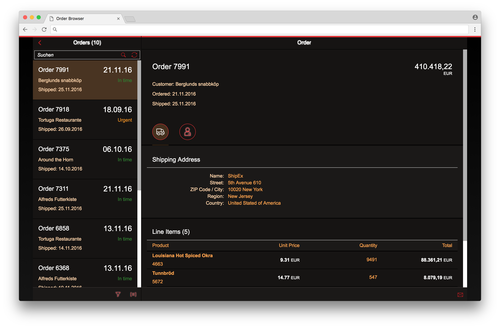

# ui5con17-custom-theme
> [OpenUI5](https://github.com/SAP/openui5) custom theme example for UI5con 2017 built using the UI5 Tooling

Please note that this is just a very basic example project to show how custom themes can be created and built. The theme is not intended to be used with real applications and does not cover all parameters, controls and libraries.



## Getting started
* Install Node.js (from [nodejs.org](http://nodejs.org/)).
* Clone the repository and navigate into it
    ```sh
    git clone https://github.com/matz3/ui5con17-custom-theme.git
    cd ui5con17-custom-theme
    ```
* Checkout the `ui5-tooling` branch
    ```sh
    git checkout ui5-tooling
    ```
* Install all npm dependencies
    ```sh
    npm install
    ```

## Usage
### Server
Run `npm start` to start a local server.  
Open the test page: http://localhost:8080/test-resources/ui5con17-custom-theme/index.html

### Build
Run `npm run build` to build the theme to `/dist`.
